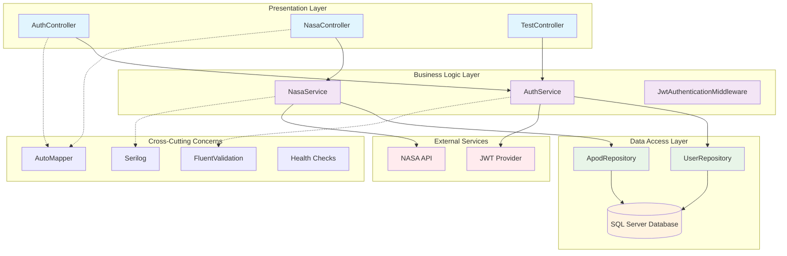
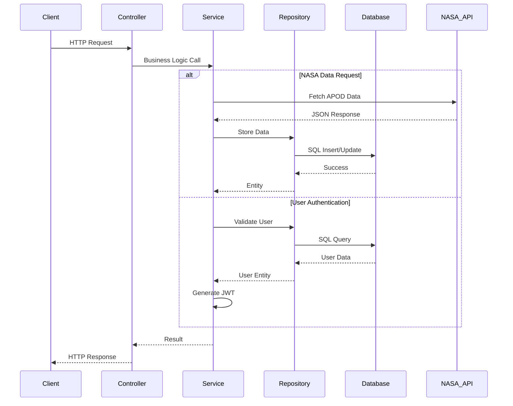
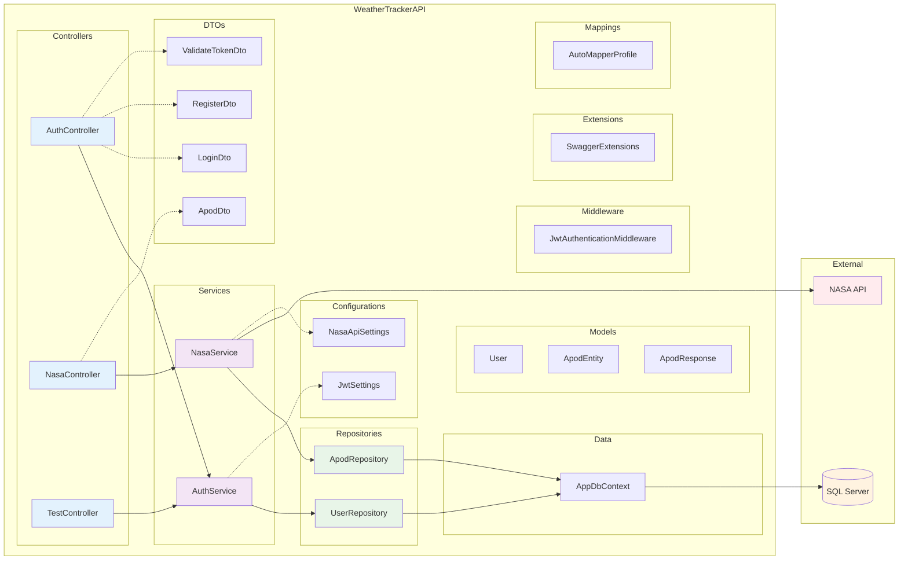

# WeatherTrackerAPI 🚀

Uma API RESTful desenvolvida em .NET 8 que integra com a NASA API para coletar, processar e armazenar dados astronômicos, fornecendo endpoints seguros para consulta de informações espaciais históricas e em tempo real.

## 📋 Índice

- [Visão Geral](#visão-geral)
- [Tecnologias Utilizadas](#tecnologias-utilizadas)
- [Arquitetura do Projeto](#arquitetura-do-projeto)
- [Funcionalidades](#funcionalidades)
- [Pré-requisitos](#pré-requisitos)
- [Configuração e Instalação](#configuração-e-instalação)
- [Estrutura do Projeto](#estrutura-do-projeto)
- [API Endpoints](#api-endpoints)
- [Autenticação e Autorização](#autenticação-e-autorização)
- [Banco de Dados](#banco-de-dados)
- [Configurações](#configurações)
- [Testes](#testes)
- [Documentação da API](#documentação-da-api)

## 🎯 Visão Geral

O WeatherTrackerAPI é uma aplicação backend desenvolvida como parte de uma avaliação técnica para demonstrar conhecimentos em:

- **Integração com APIs externas** (NASA API - Astronomy Picture of the Day)
- **Arquitetura em camadas** com .NET 8
- **Autenticação JWT**
- **Persistência de dados** com Entity Framework Core e SQL Server
- **Documentação** com Swagger/OpenAPI
- **Boas práticas** de desenvolvimento
- **Testes unitários e integração** com xUnit

### Objetivo Principal

Criar uma API que consuma dados da NASA API (Astronomy Picture of the Day - APOD), processe essas informações, as armazene em um banco de dados SQL Server e forneça endpoints seguros para consulta de dados históricos e tendências astronômicas.

## 🛠️ Tecnologias Utilizadas

### Backend

- **.NET 8** - Framework principal
- **ASP.NET Core Web API** - Para criação da API REST
- **Entity Framework Core** - ORM para acesso ao banco de dados
- **SQL Server** - Banco de dados principal
- **AutoMapper** - Mapeamento entre objetos
- **JWT Bearer** - Autenticação e autorização

### Ferramentas e Bibliotecas

- **Swagger/OpenAPI** - Documentação da API
- **Serilog** - Logging estruturado
- **FluentValidation** - Validação de dados
- **BCrypt.Net** - Hash de senhas
- **Health Checks** - Monitoramento da aplicação
- **xUnit** - Framework de testes
- **Microsoft.AspNetCore.Mvc.Testing** - Testes de integração

## 🏗️ Arquitetura do Projeto

### Estrutura de Camadas



### Fluxo de Dados



### Diagrama de Componentes



### Principais Funcionalidades

#### 1. ✅ Integração com API de Terceiros

- **NASA APOD API**: Busca dados astronômicos diários
- **Processamento**: Transformação e validação dos dados
- **Cache**: Armazenamento em cache para otimização

#### 2. ✅ Banco de Dados SQL Server

- **Entity Framework Core**: ORM para acesso aos dados
- **Migrações**: Controle de versão do banco
- **Consultas otimizadas**: Queries eficientes

#### 3. ✅ Autenticação e Autorização

- **JWT Tokens**: Autenticação stateless
- **Roles**: Controle de acesso baseado em funções
- **Middleware personalizado**: Para logging e validação

## 📋 Pré-requisitos

- **.NET 8 SDK** ou superior
- **SQL Server** 2019 ou superior (ou SQL Server Express)
- **Visual Studio Code** ou **Visual Studio** (recomendado)
- **Git** para controle de versão

## ⚙️ Configuração e Instalação

### 1. Clone o repositório

```bash
git clone https://github.com/ItaloRochaj/WeatherTrackerAPI.git
cd WeatherTrackerAPI
```

### 2. Configure o banco de dados SQL Server

Certifique-se de que o SQL Server está executando e configure a connection string no `appsettings.json`:

```json
{
  "ConnectionStrings": {
    "DefaultConnection": "Server=localhost\\MSSQLSERVER01;Database=weather_trackerapi;User Id=developer;Password=YourPassword;TrustServerCertificate=true;"
  }
}
```

### 3. Configure as dependências da NASA API

Atualize a chave da API no `appsettings.json`:

```json
{
  "NasaApiSettings": {
    "BaseUrl": "https://api.nasa.gov/planetary/apod",
    "ApiKey": "SUA_CHAVE_NASA_API_AQUI"
  }
}
```

### 4. Restaure os pacotes e execute as migrações

```bash
dotnet restore
dotnet ef database update
```

### 5. Execute a aplicação

```bash
dotnet run
```

A aplicação estará disponível em:

- **HTTP**: `http://localhost:5170`
- **HTTPS**: `https://localhost:7230`
- **Swagger UI**: `https://localhost:7230/swagger` (página inicial)

## 🗂️ Estrutura do Projeto

```text
WeatherTrackerAPI/
├── Controllers/           # Controladores da API
│   ├── AuthController.cs
│   ├── NasaController.cs
│   └── TestController.cs
├── Services/             # Lógica de negócio
│   ├── AuthService.cs
│   └── NasaService.cs
├── Repositories/         # Acesso a dados
│   ├── UserRepository.cs
│   └── ApodRepository.cs
├── Models/              # Entidades do domínio
│   ├── User.cs
│   ├── ApodEntity.cs
│   └── ApodResponse.cs
├── DTOs/                # Data Transfer Objects
│   ├── LoginDto.cs
│   ├── RegisterDto.cs
│   ├── ApodDto.cs
│   └── ValidateTokenDto.cs
├── Data/                # Contexto do banco
│   └── AppDbContext.cs
├── Configurations/      # Configurações
│   ├── JwtSettings.cs
│   └── NasaApiSettings.cs
├── Middleware/          # Middlewares personalizados
│   └── JwtAuthenticationMiddleware.cs
├── Mappings/            # AutoMapper profiles
│   └── AutoMapperProfile.cs
├── Extensions/          # Extensions methods
│   └── SwaggerExtensions.cs
├── Migrations/          # Migrações do EF Core
└── WeatherTrackerAPI.Tests/  # Projeto de testes
    ├── UnitTest1.cs
    └── WeatherTrackerAPI.Tests.csproj
```

## 🔐 API Endpoints

### Autenticação (`/api/auth`)

| Método | Endpoint | Descrição | Autenticação |
|--------|----------|-----------|--------------|
| POST | `/register` | Registra novo usuário | ❌ |
| POST | `/login` | Login do usuário | ❌ |
| POST | `/validate` | Valida token JWT | ❌ |

### NASA APOD (`/api/nasa`)

| Método | Endpoint | Descrição | Autenticação |
|--------|----------|-----------|--------------|
| GET | `/apod` | Obtém APOD por data | ✅ |
| GET | `/apod/random` | Obtém APOD aleatória | ✅ |
| GET | `/apod/range` | Obtém APODs em intervalo | ✅ |
| GET | `/apod/stored` | Lista APODs armazenadas | ✅ |
| GET | `/apod/trends` | Obtém tendências | ✅ |
| PUT | `/apod/{id}/rating` | Atualiza avaliação | ✅ |
| POST | `/apod/{id}/favorite` | Favorita/desfavorita | ✅ |
| POST | `/apod/sync` | Sincroniza da NASA | ✅ (Admin) |

### Monitoramento

| Método | Endpoint | Descrição |
|--------|----------|-----------|
| GET | `/health` | Health check da aplicação |

## 🗄️ Banco de Dados

### Estrutura do Banco de Dados

#### Users

- **Id**: GUID (PK)
- **Email**: VARCHAR(255) UNIQUE
- **PasswordHash**: VARCHAR(255)
- **FirstName**: VARCHAR(100)
- **LastName**: VARCHAR(100)
- **Role**: VARCHAR(50)
- **CreatedAt**: DATETIME
- **UpdatedAt**: DATETIME
- **IsActive**: BOOLEAN

#### ApodData

- **Id**: GUID (PK)
- **Date**: DATETIME UNIQUE
- **Title**: VARCHAR(500)
- **Explanation**: TEXT
- **Url**: VARCHAR(2000)
- **HdUrl**: VARCHAR(2000)
- **MediaType**: VARCHAR(50)
- **Copyright**: VARCHAR(200)
- **CreatedAt**: DATETIME
- **UpdatedAt**: DATETIME
- **ViewCount**: INT
- **Rating**: DOUBLE
- **IsFavorited**: BOOLEAN

## 🧪 Testes

O projeto inclui um conjunto abrangente de testes para garantir a qualidade e confiabilidade do código.

### Executar Testes

```bash
# Executar todos os testes
dotnet test

# Executar testes com relatório de cobertura
dotnet test --collect:"XPlat Code Coverage"

# Executar testes específicos
dotnet test --filter "FullyQualifiedName~AuthController"
```

### Estrutura de Testes

```text
WeatherTrackerAPI.Tests/
├── UnitTest1.cs                    # Testes básicos de exemplo
└── WeatherTrackerAPI.Tests.csproj  # Configuração do projeto de testes
```

### Tecnologias de Teste

- **xUnit 2.9.2** - Framework de testes principal
- **Microsoft.AspNetCore.Mvc.Testing** - Testes de integração
- **Moq 4.20.72** - Biblioteca de mocking
- **FluentAssertions** - Assertions mais legíveis
- **Microsoft.EntityFrameworkCore.InMemory** - Banco de dados em memória para testes

### Tipos de Testes Implementados

- **Testes Unitários**: Validação de lógica de negócio isolada
- **Testes de Integração**: Validação de endpoints da API
- **Testes de Repositório**: Validação de acesso a dados
- **Testes de Serviços**: Validação de regras de negócio

## 📚 Documentação da API

A documentação completa da API está disponível através do Swagger UI quando a aplicação está em execução:

- **URL**: `https://localhost:7240`
- **Swagger JSON**: `https://localhost:7240/swagger/v1/swagger.json`

### Exemplo de Uso

#### 1. Registrar usuário
```bash
curl -X POST "https://localhost:7240/api/auth/register" \
  -H "Content-Type: application/json" \
  -d '{
    "email": "usuario@exemplo.com",
    "password": "MinhaSenh@123",
    "confirmPassword": "MinhaSenh@123",
    "firstName": "João",
    "lastName": "Silva"
  }'
```

#### 2. Fazer login
```bash
curl -X POST "https://localhost:7240/api/auth/login" \
  -H "Content-Type: application/json" \
  -d '{
    "email": "usuario@exemplo.com",
    "password": "MinhaSenh@123"
  }'
```

#### 3. Obter APOD (com token)
```bash
curl -X GET "https://localhost:7240/api/nasa/apod?date=2024-01-01" \
  -H "Authorization: Bearer SEU_TOKEN_JWT_AQUI"
```

## 🔧 Configurações

### JWT Settings
```json
{
  "JwtSettings": {
    "Secret": "sua-chave-secreta-aqui-minimo-32-caracteres",
    "Issuer": "WeatherTrackerAPI",
    "Audience": "WeatherTrackerAPI-Users",
    "ExpirationInMinutes": 60
  }
}
```

### NASA API Settings
```json
{
  "NasaApi": {
    "BaseUrl": "https://api.nasa.gov/",
    "ApiKey": "sua-chave-nasa-api",
    "RateLimitPerHour": 1000,
    "TimeoutInSeconds": 30
  }
}
```

## 📊 Recursos Implementados

### ✅ Requisitos Obrigatórios
- [x] API Web .NET 8
- [x] Integração com API externa (NASA APOD)
- [x] Controlador para buscar dados externos
- [x] Processamento/transformação de dados
- [x] Persistência em banco de dados (SQL Server)
- [x] Autenticação JWT
- [x] Documentação Swagger

### ✅ Funcionalidades Extras

- [x] Cache em memória
- [x] Health checks
- [x] Logging estruturado (Serilog)
- [x] Validação com FluentValidation
- [x] AutoMapper para mapeamentos
- [x] Middleware personalizado
- [x] Paginação
- [x] Sistema de avaliações
- [x] Favoritos
- [x] Testes unitários com xUnit

## 🚀 Deploy e Produção

Para deploy em produção, considere:

1. **Variáveis de ambiente** para configurações sensíveis
2. **HTTPS** obrigatório
3. **Rate limiting** para APIs externas
4. **Monitoramento** com Application Insights
5. **Docker** para containerização

---
### 👨🏻‍💻 Autor:
<table style="border=0">
  <tr>
    <td align="left">
      <a href="https://github.com/ItaloRochaj">
        <span><b>Italo Rocha</b></span>
      </a>
      <br>
      <span>Full-Stack Development</span>
    </td>
  </tr>
</table>
---

**NASA API**: Este projeto utiliza a [NASA Open Data API](https://api.nasa.gov/) para obter dados da Astronomy Picture of the Day (APOD).

